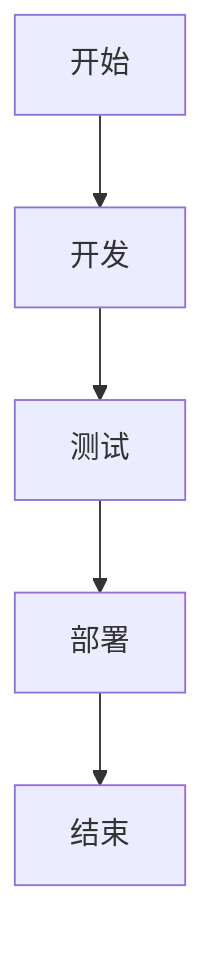

# Cursor 1.0 新功能详解：BugBot、Background Agent、一键安装MCP等重磅更新

## 简介

Cursor 1.0 版本正式发布，带来了多项重磅功能更新，包括自动代码审查工具 BugBot、面向所有用户的 Background Agent、一键安装 MCP 服务器、Jupyter 支持以及全新的记忆功能。本文将详细介绍这些新功能，并附上示例，帮助您快速上手。

---

## 一、BugBot：自动代码审查

BugBot 能够自动审查您的 Pull Request，及时发现潜在的 bug 和问题。当发现问题时，BugBot 会在 GitHub 上留下评论，您只需点击"**Fix in Cursor**"即可返回编辑器，并自动填充修复问题的提示。

### 示例

假设您在 GitHub 上提交了一个 PR，BugBot 检测到代码中存在未处理的异常：

```python
def divide(a, b):
    return a / b  # 未处理除零异常
```

BugBot 会在 PR 中评论：

> 检测到潜在问题：未处理除零异常。点击"Fix in Cursor"修复。

点击后，Cursor 会自动打开编辑器，并提示您添加异常处理：

```python
def divide(a, b):
    if b == 0:
        raise ValueError("除数不能为零")
    return a / b
```

---

## 二、Background Agent：面向所有用户

Background Agent 是 Cursor 的远程编码助手，此前仅限早期用户使用，现在已向所有用户开放。您可以通过点击聊天界面中的云图标或按下 `Cmd/Ctrl+E`（隐私模式未启用时）快速启动 Background Agent。

### 示例

在 Cursor 中，按下 `Cmd/Ctrl+E`，Background Agent 会弹出控制面板，您可以直接输入需求，例如：

> 请帮我优化这段代码的性能。

Background Agent 会分析代码并提供优化建议。

---

## 三、Jupyter Notebook 支持

Cursor 现在支持在 Jupyter Notebook 中直接实现代码修改。Agent 可以在 Jupyter 中创建和编辑多个单元格，大幅提升数据科学和研究任务的效率。目前仅支持 Sonnet 模型。

### 示例

在 Jupyter Notebook 中，您可以直接输入：

> 请帮我实现一个简单的线性回归模型。

Agent 会自动创建并编辑单元格，生成如下代码：

```python
import numpy as np
from sklearn.linear_model import LinearRegression

X = np.array([[1], [2], [3]])
y = np.array([2, 4, 6])

model = LinearRegression()
model.fit(X, y)

print(f"斜率: {model.coef_[0]}, 截距: {model.intercept_}")
```

---

## 四、记忆功能（Memories）

记忆功能允许 Cursor 记住对话中的信息，并在未来引用。记忆按项目和个人级别存储，可通过设置管理。目前该功能处于测试阶段，您可以在设置中启用。

### 示例

在对话中，您提到：

> 我的项目使用 Python 3.9。

后续对话中，您可以直接询问：

> 请帮我检查代码兼容性。

Cursor 会自动引用您之前提到的 Python 版本，确保建议与 Python 3.9 兼容。

---

## 五、一键安装 MCP 服务器与 OAuth 支持

Cursor 现在支持一键安装 MCP 服务器，并支持 OAuth 认证。您可以在 [docs.cursor.com/tools](https://docs.cursor.com/tools) 添加官方 MCP 服务器。如果您是 MCP 开发者，可以在文档中添加"Add to Cursor"按钮，方便其他开发者使用。

### 示例

在 Cursor 中，点击"Add MCP Server"，选择官方推荐的服务器，即可一键完成安装和认证。

---

## 六、更丰富的聊天响应

Cursor 现在支持在对话中渲染可视化内容，包括 Mermaid 图表和 Markdown 表格。

### 示例

在对话中，您输入：

> 请生成一个项目流程图。

Cursor 会生成如下 Mermaid 图表：



---

## 七、全新设置与仪表盘

设置和仪表盘页面进行了优化，新增了个人或团队的使用分析、显示名称更新、详细统计等功能。

### 示例

在仪表盘中，您可以查看每日使用量、工具调用次数、模型使用情况等详细数据。

---

## 总结

Cursor 1.0 版本带来了多项重磅更新，包括自动代码审查、远程编码助手、Jupyter 支持、记忆功能、一键安装 MCP 服务器、更丰富的聊天响应以及全新的设置与仪表盘。这些功能将大幅提升您的开发效率，欢迎立即体验！

如需了解更多详情，请访问 [Cursor 官网](https://www.cursor.com/changelog/1-0)。

---

*本文内容基于 [Cursor 1.0 更新日志](https://www.cursor.com/changelog/1-0)。* 