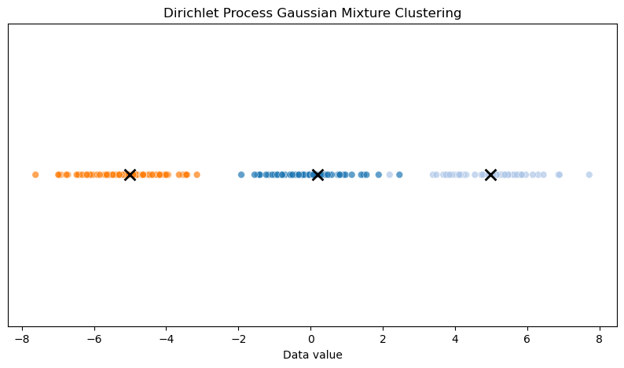

# 理解狄利克雷过程：理论、数学与应用

狄利克雷过程（Dirichlet Process, DP）是贝叶斯非参数统计的基石，为建模具有无限成分的数据提供了灵活的框架。与假设参数数量固定的参数模型不同，DP允许聚类数量无限，非常适合于底层分组或模式数量未知的场景。DP由Thomas Ferguson于1973年提出，已成为机器学习中的基础工具，尤其在聚类、密度估计和混合建模中应用广泛。本文将探讨狄利克雷过程的理论基础、数学原理及其实用应用，并通过代码示例说明其实现。

本质上，狄利克雷过程是"分布上的分布"。它是一种随机过程，可以生成随机测度（即在可能结果空间上的分布）。DP在贝叶斯非参数领域尤为吸引人，因为它允许模型随着观测数据的增加而变得更复杂，而无需事先指定成分数量。这种自适应性使其适用于如主题建模（文档主题数未知）或生物信息学（基因型数量可变）等应用。

狄利克雷过程由两个参数决定：基分布和浓度参数。基分布（通常记为 $ H $）表示随机测度的期望分布，本质上是对分布参数的先验。浓度参数（记为 $ \alpha $）控制随机测度围绕基分布的变异性。较大的 $ \alpha $ 使得随机测度更接近基分布，较小的 $ \alpha $ 则使其集中于少数几个取值。$ H $ 和 $ \alpha $ 的相互作用赋予了DP极大的灵活性，可以建模复杂的多峰数据。

狄利克雷过程记作：

$$G \sim \text{DP}(\alpha, G_0)$$

意思是"G是从狄利克雷过程（参数为$\alpha$和基分布$H$）中采样得到的随机概率分布"。

从数学角度看，设可测空间 $ \Theta $，DP是$\Theta$上的随机概率测度$G$，使得对$\Theta$的任意有限划分 $ \{A_1, A_2, \dots, A_k\} $，概率向量 $ (G(A_1), G(A_2), \dots, G(A_k)) $ 服从参数为 $ (\alpha H(A_1), \alpha H(A_2), \dots, \alpha H(A_k)) $ 的狄利克雷分布。这保证了$G$在不同划分下的一致性，是DP作为随机过程的关键特性。狄利克雷分布是Beta分布的多元推广，常用于贝叶斯统计中对多分类概率建模。

最直观理解DP的方法之一是其"断棒(stick-breaking)"表示，由Sethuraman于1994年提出。想象一根长度为1的棍子，你要把它断成无数段，每一段代表随机测度中某个原子的权重。断棒过程是：先采样一系列独立的Beta随机变量 $ V_i \sim \text{Beta}(1, \alpha) $，第$i$个原子的权重为 $ \pi_i = V_i \prod_{j=1}^{i-1} (1 - V_j) $，原子的位置 $ \theta_i $ 独立地从基分布$H$采样。最终随机测度为 $ G = \sum_{i=1}^\infty \pi_i \delta_{\theta_i} $，其中 $ \delta_{\theta_i} $ 是在$\theta_i$处的点质量。这一构造突出了DP的离散性：结果测度几乎必然是离散的，概率质量集中在可数无限个点上。

断棒表示不仅是理论工具，也非常有计算意义。我们可以通过截断有限项来近似无限和，这在实际算法实现中很有用。例如在聚类应用中，每个 $ \theta_i $ 可代表一个簇的参数，$ \pi_i $ 决定数据点属于该簇的概率。随着数据增多，DP可以通过为新原子分配非零权重来生成新簇，从而自适应数据的复杂度。

以高斯（正态）分布为例，一个簇的参数包括：
  - **均值** ($\mu$)：簇的中心
  - **方差** ($\sigma^2$) 或 **精度** ($\tau = 1/\sigma^2$)：簇的离散程度

- 在混合模型中，**$\theta_i$** 是第$i$个簇参数的通用符号。
- 对高斯混合，$\theta_i = (\mu_i, \sigma_i^2)$ 或 $\theta_i = (\mu_i, \tau_i)$。
- 对其他分布，$\theta_i$ 就是该分布的参数（如Poisson分布为$\lambda$，多项分布为各类别概率等）。

在狄利克雷过程混合模型（DPMM）中，簇的数量是无限（或非常大）的。每个簇$i$有自己的参数$\theta_i$。当你将一个数据点分配到某个簇时，意味着"该数据点是由参数为$\theta_i$的分布生成的"。

### 示例（高斯混合）

假设有3个簇：
- 簇1: $\theta_1 = (\mu_1 = -5, \sigma_1^2 = 1)$
- 簇2: $\theta_2 = (\mu_2 = 0, \sigma_2^2 = 1)$
- 簇3: $\theta_3 = (\mu_3 = 5, \sigma_3^2 = 1)$

如果某数据点被分到簇2，则认为它是从均值为0、方差为1的正态分布中采样的。

---

### 总结表

| 簇 | $\theta_i$（参数） | 含义 |
|----|-------------------|--------------------------|
| 1  | ($\mu_1$, $\sigma_1^2$) | 簇1的均值和方差 |
| 2  | ($\mu_2$, $\sigma_2^2$) | 簇2的均值和方差 |
| ...| ...               | ...                      |

---

**简而言之：**  
> 每个$\theta_i$是一组定义第$i$个簇概率分布的参数。对于高斯分布，就是均值和方差（或精度）。


另一种理解DP的方式是"中餐馆过程（Chinese Restaurant Process, CRP）"，它提供了数据点如何分配到簇的生成视角。想象一家有无限张桌子的餐馆，每张桌子对应一道从$H$采样的菜。第一个顾客坐在第一张桌子，吃一道从$H$采样的菜。后续顾客要么以与该桌人数成比例的概率加入已有桌子，要么以与$\alpha$成比例的概率开新桌。具体地，第$n$个顾客以 $\frac{n_k}{\alpha + n - 1}$ 的概率加入第$k$桌（$n_k$为该桌人数），以 $\frac{\alpha}{\alpha + n - 1}$ 的概率开新桌。这一过程自然形成了聚类结构：热门桌子（簇）会变大，但新桌子也总有可能出现，体现了DP的非参数本质。

CRP的一个重要特性是"可交换性"：数据的联合分布与观测顺序无关。这在贝叶斯建模中很关键，保证了模型预测不依赖于数据的任意排序。CRP与断棒表示也直接相关：桌子的权重对应断棒权重$\pi_i$，每桌的菜对应原子$\theta_i$。

从数学性质看，DP的期望和方差如下：随机测度$G$的期望是基分布$H$，即 $E[G(A)] = H(A)$，对任意可测集$A$。方差为 $\text{Var}(G(A)) = \frac{H(A)(1 - H(A))}{\alpha + 1}$，说明$\alpha$控制了测度的变异性。$\alpha$小则测度高度集中于少数原子，$\alpha$大则$G$更接近$H$。这些性质使DP成为贝叶斯推断中强大的先验，兼顾了先验知识（$H$）和灵活性（$\alpha$）。

DP最常用于混合模型（Dirichlet Process Mixture Models, DPMM）。在DPMM中，每个数据点假定由若干分布的混合生成，混合权重和成分参数都由DP采样。例如高斯混合模型中，每个成分是参数为$\theta_i = (\mu_i, \Sigma_i)$的高斯分布。DP先验允许成分数量无限，但实际只需有限成分即可拟合观测数据，因为$\pi_i$在$i$较大时迅速衰减。

实现DPMM时，常用马尔可夫链蒙特卡洛（MCMC）方法（如Gibbs采样）或变分推断来近似后验分布。Gibbs采样会根据CRP概率迭代更新每个数据点的簇分配，并根据数据似然更新簇参数。变分推断则通过优化一个更简单的分布来逼近真实后验，通常采用截断断棒近似。

下面用Python实现一个简单的高斯DPMM。我们用`numpy`和`scipy`生成数据并实现Gibbs采样器，目标是对未知成分数量的1维高斯混合数据进行聚类。


```python
import numpy as np
from scipy.stats import norm, gamma

# 生成3个高斯分布的混合数据
data = ... # 代码同上

# 参数
data = ... # 代码同上

# 初始化
z = ... # 代码同上

# Gibbs采样
for _ in range(n_iter):
    ... # 代码同上

# 打印结果
unique_clusters = np.unique(z)
print(f"Estimated number of clusters: {len(unique_clusters)}")
for k in unique_clusters:
    print(f"Cluster {k}: mean={means[k]:.2f}, precision={precisions[k]:.2f}, count={counts[k]}")
```

    Estimated number of clusters: 3
    Cluster 3: mean=0.20, precision=1.06, count=59
    Cluster 6: mean=4.99, precision=1.10, count=61
    Cluster 19: mean=-5.01, precision=1.13, count=80


```python
import matplotlib.pyplot as plt
import seaborn as sns

# 可视化聚类结果
plt.figure(figsize=(10, 5))
sns.scatterplot(x=data, y=[0]*len(data), hue=z, palette='tab20', legend=False, s=40, alpha=0.7)
# 绘制簇均值
for k in np.unique(z):
    plt.scatter(means[k], 0, color='black', marker='x', s=100, linewidths=2)
plt.title('Dirichlet Process Gaussian Mixture Clustering')
plt.xlabel('Data value')
plt.yticks([])
plt.show()
```


    

