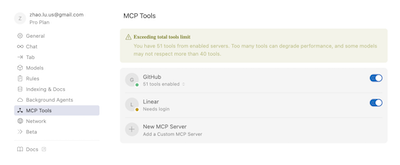

# Cursor 1.0 版本 GitHub MCP 全面指南：从安装到工作流增强

## 简介

GitHub MCP (Machine Coding Protocol) 是一种强大的工具，能够自动化代码生成、管理和分析，从而显著提升开发效率。本文将全面介绍 GitHub MCP 的安装、配置、使用以及如何将其融入您的工作流。 本文介绍两种MCP配置方式，一种是使用Cursor 1.0 版本内置的MCP Server，另一种是使用Docker 容器运行MCP Server。

---

## 一、启用 Background Agent 与隐私模式设置

在Cursor 1.0 版本中，启用Background Agent 是使用MCP Tools 的前提条件。

### 1. 什么是 Background Agent？
- Background Agent 是 Cursor 的"云端/远程智能代理"功能，为 MCP Tools 等自动化工具提供运行基础。
- 启用后，Cursor 可以在云端或本地远程环境中调度和管理 MCP Server。

### 2. 启用 Background Agent 的步骤
1. 打开 Cursor 设置（Settings），在侧边栏找到 **Background Agent**。
2. 将"Background Agent"开关切换为开启（蓝色）。
3. 如有"Start a Background Agent"按钮，可点击启动。

### 3. 关闭 Privacy Mode（隐私模式）
- 如果你发现"Enable Background Agent"无法启用，通常是因为开启了 Privacy Mode。
- 关闭方法：
  1. 在 Settings 顶部搜索框输入 `privacy` 或"隐私"。
  2. 找到"Privacy Mode"或"隐私模式"开关，将其关闭（off/灰色）。
  3. 关闭后建议重启 Cursor。
- 关闭隐私模式后，再次尝试启用 Background Agent。

### 4. Background Agent 与 MCP Tools 的关系
- Background Agent 是 MCP Tools 的基础设施，必须先启用。
- 启用后，才能在 MCP Tools 面板添加、启用和管理 MCP Server。


### 5. 配置GitHub MCP Server



Cursor 现在支持一键安装 MCP 服务器，并支持 OAuth 认证。您可以在 [docs.cursor.com/tools](https://docs.cursor.com/tools) 添加官方 MCP 服务器。如果您是 MCP 开发者，可以在文档中添加"Add to Cursor"按钮，方便其他开发者使用。

注意：Docker Desktop 需要先启动。Github MCP 才可以正常工作。

---

## 二、MCP Tool 专属输入界面说明

### 1. MCP Tool 输入与 Cursor AI Agent 输入的区别
- **MCP Tool 输入**：专门用于与 MCP Server（如 GitHub MCP）交互，支持自动化代码生成、分析、文档等高级功能。
- **Cursor AI Agent 输入**：即你和本地 Copilot/AI 助手的对话框，仅由本地 AI 处理，不会自动转发到 MCP Server。
- **注意**：在 AI 聊天对话框输入的问题，不会被 MCP Server 处理，只有在 MCP Tool 专属入口输入才会由 MCP Server 响应。

### 2. MCP Tool 的输入界面在哪里？
- **Settings > MCP Tools 面板**：在设置侧边栏点击 MCP Tools，选择已启用的 MCP Server，部分版本会有"Ask"或"Send"按钮，弹出专属输入框。
- **编辑器右键菜单**：在代码区选中代码或空白处，右键菜单可能出现"Send to MCP"或"Ask MCP"选项。
- **命令面板**：按 `Cmd+K` 或 `Cmd+Shift+P`，输入 `MCP`，查找"Ask MCP"或相关命令。
- **部分版本支持底部/侧边栏弹出 MCP 输入框**，可直接输入问题或需求。

### 3. 典型操作流程
1. 在 MCP Tools 面板启用 MCP Server（如 GitHub MCP）。
2. 在 MCP Tools 面板、编辑器右键菜单或命令面板找到 MCP 专属输入入口。
3. 输入你的问题、需求或代码片段，点击发送。
4. 等待 MCP Server 返回结果，结果会显示在专属面板、弹窗或代码区。

### 4. 常见误区
- **不要在 AI 聊天对话框输入 MCP 问题**，否则只会由本地 AI 处理。
- **务必在 MCP Tool 专属入口输入**，才能体验 MCP 的自动化和高级功能。

---

## 三、Docker 依赖与 Cursor 的自动化管理

### 1. 必须先启动本地 Docker 服务

- Cursor 的 MCP Tools（如 GitHub MCP Server）依赖 Docker 容器来运行服务。
- 如果你的 Docker Desktop（或其他 Docker 服务）没有启动，Cursor 无法自动拉取和运行 MCP Server 镜像。
- 你需要手动确保 Docker 已经在运行（比如在 macOS 上，点击 Docker 图标，确保它是绿色的"Docker Desktop is running"状态）。

### 2. Cursor 无法自动启动 Docker

- 出于安全和权限考虑，Cursor 不能直接帮你"唤醒"或启动 Docker Desktop。
- 你必须手动启动 Docker 服务。

### 3. Cursor 会自动管理 MCP Server 容器

- 在 MCP Tools 面板启用 MCP Server 后，Cursor 会自动用 docker run ... 命令启动 MCP Server。
- 关闭 MCP Server，Cursor 会自动停止对应的容器。
- 你无需手动在终端输入 docker 命令，也无需关心容器的具体参数。

### 4. 常见问题

- 如果 Docker 没有启动，Cursor 在尝试启动 MCP Server 时会失败，通常会在 MCP Tools 面板显示相关错误（如"Cannot connect to the Docker daemon"）。
- 建议每次重启电脑后，先启动 Docker Desktop，再打开 Cursor 并启用 MCP Server。
- 如需进一步自动化（比如开机自启 Docker），可以在 Docker Desktop 设置中配置"开机自动启动"。

---

## 四、GitHub MCP 的核心功能

### 1. 自动代码生成

GitHub MCP 可以根据您的需求自动生成代码片段或完整模块，减少手动编码的工作量。

#### 示例

假设您需要生成一个简单的 REST API 接口，您可以在 Cursor 中输入：

> 请生成一个用户注册的 REST API 接口。

GitHub MCP 将自动生成如下代码：

```python
from flask import Flask, request, jsonify

app = Flask(__name__)

@app.route('/register', methods=['POST'])
def register():
    data = request.get_json()
    username = data.get('username')
    password = data.get('password')
    # 处理用户注册逻辑
    return jsonify({"message": "用户注册成功"}), 201

if __name__ == '__main__':
    app.run(debug=True)
```

### 2. 代码分析与优化

GitHub MCP 可以分析您的代码，提供优化建议，帮助您提高代码质量和性能。

#### 示例

假设您有一段性能较差的代码：

```python
def find_duplicates(arr):
    duplicates = []
    for i in range(len(arr)):
        for j in range(i + 1, len(arr)):
            if arr[i] == arr[j]:
                duplicates.append(arr[i])
    return duplicates
```

GitHub MCP 可以分析并建议优化为：

```python
def find_duplicates(arr):
    seen = set()
    duplicates = []
    for item in arr:
        if item in seen:
            duplicates.append(item)
        else:
            seen.add(item)
    return duplicates
```

### 3. 自动化测试生成

GitHub MCP 可以根据您的代码自动生成单元测试，确保代码的可靠性和稳定性。

#### 示例

假设您有一个计算函数：

```python
def add(a, b):
    return a + b
```

GitHub MCP 可以自动生成测试用例：

```python
import unittest

class TestAdd(unittest.TestCase):
    def test_add(self):
        self.assertEqual(add(1, 2), 3)
        self.assertEqual(add(-1, 1), 0)
        self.assertEqual(add(0, 0), 0)

if __name__ == '__main__':
    unittest.main()
```

### 4. 文档生成

GitHub MCP 可以根据您的代码自动生成文档，帮助团队更好地理解和使用您的代码。

#### 示例

假设您有一个函数：

```python
def calculate_area(length, width):
    return length * width
```

GitHub MCP 可以生成文档：

```markdown
# calculate_area

计算矩形的面积。

## 参数

- `length` (float): 矩形的长度。
- `width` (float): 矩形的宽度。

## 返回值

- `float`: 矩形的面积。
```

---

## 五、如何将 GitHub MCP 融入您的工作流

### 1. 日常开发

在开发过程中，您可以使用 GitHub MCP 快速生成代码片段、优化现有代码、生成测试用例和文档，从而节省时间并提高代码质量。

### 2. 代码审查

在代码审查阶段，GitHub MCP 可以自动分析代码，提供优化建议，帮助您更快地发现和修复问题。

### 3. 团队协作

GitHub MCP 生成的文档和测试用例可以帮助团队成员更好地理解和使用您的代码，促进团队协作。

---

## 六、版本控制与安全性

### 1. 在 mcp_config.yml 中省略 GitHub Token

如果您希望将 `mcp_config.yml` 文件纳入版本控制，同时避免暴露敏感的 GitHub Personal Access Token (PAT)，可以选择在 `mcp_config.yml` 中省略 Token 定义。此时，MCP 服务器将自动使用 `.cursor/mcp.json` 中定义的 Token。

### 2. 配置示例

在 `mcp_config.yml` 中省略 Token：

```yaml
# MCP 服务器配置
server:
  host: localhost
  port: 8080

# GitHub 配置
github:
  repo: YOUR_REPO_NAME
  branch: main

# 工具配置
tools:
  - name: code-generator
    enabled: true
  - name: code-analyzer
    enabled: true
```

在 `.cursor/mcp.json` 中定义 Token：

```json
{
  "mcpServers": {
    "GitHub": {
      "command": "docker",
      "args": [
        "run",
        "-i",
        "--rm",
        "-e",
        "GITHUB_PERSONAL_ACCESS_TOKEN",
        "ghcr.io/github/github-mcp-server"
      ],
      "env": {
        "GITHUB_PERSONAL_ACCESS_TOKEN": "YOUR_GITHUB_PAT"
      }
    }
  }
}
```

---

## 总结

GitHub MCP 通过自动代码生成、代码分析与优化、自动化测试生成和文档生成等功能，显著提升开发效率。将其融入您的工作流，可以帮助您节省时间、提高代码质量，并促进团队协作。

如需了解更多详情，请参考 [GitHub MCP 官方文档](https://docs.github.com/en/mcp)。