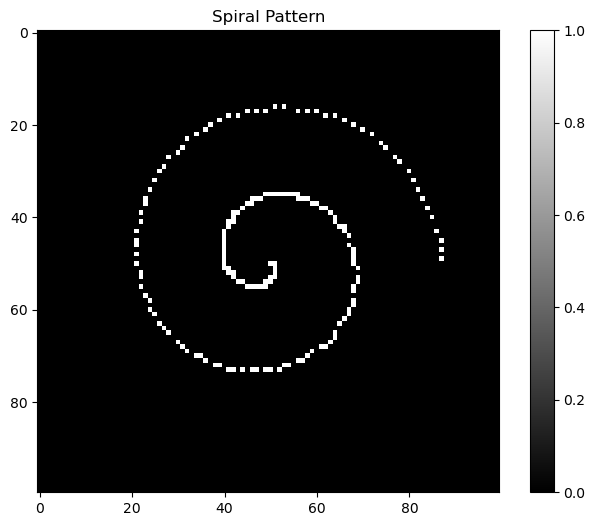

# 创建清晰图像：随机噪声的替代方案

本笔记本演示了创建清晰、结构化图像的各种方法，而不是使用生成噪声图像的 `np.random.rand()`。


```python
import numpy as np
import matplotlib.pyplot as plt
from PIL import Image
import requests
from io import BytesIO

# 设置绘图样式
plt.style.use('default')
plt.rcParams['figure.figsize'] = (12, 8)
```

## 1. 几何形状


```python
# 创建具有几何形状的清晰图像
image = np.zeros((100, 100))

# 在中心添加白色圆形
y, x = np.ogrid[:100, :100]
center_y, center_x = 50, 50
radius = 20
circle = (x - center_x)**2 + (y - center_y)**2 <= radius**2
image[circle] = 1.0

# 添加白色矩形
image[20:40, 60:80] = 1.0

plt.figure(figsize=(8, 6))
plt.imshow(image, cmap='gray')
plt.title('清晰的几何形状')
plt.colorbar()
plt.show()
```


    

    


## 2. 渐变图像


```python
# 创建渐变图像
x = np.linspace(0, 1, 100)
y = np.linspace(0, 1, 100)
X, Y = np.meshgrid(x, y)
image = X + Y  # 线性渐变

plt.figure(figsize=(8, 6))
plt.imshow(image, cmap='viridis')
plt.title('渐变图像')
plt.colorbar()
plt.show()

# 径向渐变
center_y, center_x = 50, 50
y, x = np.ogrid[:100, :100]
distance = np.sqrt((x - center_x)**2 + (y - center_y)**2)
radial_gradient = 1 - distance / np.max(distance)

plt.figure(figsize=(8, 6))
plt.imshow(radial_gradient, cmap='plasma')
plt.title('径向渐变')
plt.colorbar()
plt.show()
```


    

    


    

    


## 3. 棋盘格图案


```python
# 创建棋盘格图案
image = np.zeros((100, 100))
for i in range(0, 100, 20):
    for j in range(0, 100, 20):
        if (i + j) % 40 == 0:
            image[i:i+20, j:j+20] = 1.0

plt.figure(figsize=(8, 6))
plt.imshow(image, cmap='gray')
plt.title('棋盘格图案')
plt.colorbar()
plt.show()

# 替代方案：使用numpy操作获得更清晰的代码
def create_checkerboard(size, square_size):
    """使用numpy操作创建棋盘格图案"""
    pattern = np.zeros((size, size))
    for i in range(0, size, square_size):
        for j in range(0, size, square_size):
            if (i + j) % (2 * square_size) == 0:
                pattern[i:i+square_size, j:j+square_size] = 1.0
    return pattern

checkerboard = create_checkerboard(100, 10)
plt.figure(figsize=(8, 6))
plt.imshow(checkerboard, cmap='gray')
plt.title('棋盘格图案（更小的方块）')
plt.colorbar()
plt.show()
```


    

    


    

    


## 4. 文字或字母


```python
# 创建简单的字母'A'
image = np.zeros((100, 100))

# 绘制线条形成字母A
for i in range(20, 80):
    # 左对角线
    if 20 <= i <= 50:
        image[i, 50-i+20] = 1.0
    # 右对角线  
    if 20 <= i <= 50:
        image[i, i+20] = 1.0
    # 水平线
    if 35 <= i <= 65:
        image[35, i] = 1.0

plt.figure(figsize=(8, 6))
plt.imshow(image, cmap='gray')
plt.title('字母A')
plt.colorbar()
plt.show()

# 创建简单的十字图案
cross = np.zeros((100, 100))
cross[40:60, :] = 1.0  # 水平线
cross[:, 40:60] = 1.0  # 垂直线

plt.figure(figsize=(8, 6))
plt.imshow(cross, cmap='gray')
plt.title('十字图案')
plt.colorbar()
plt.show()
```


    

    


    

    


## 5. 加载真实图像


```python
# 从URL加载真实图像
try:
    url = "https://upload.wikimedia.org/wikipedia/commons/thumb/2/2f/Google_2015_logo.svg/1200px-Google_2015_logo.svg.png"
    response = requests.get(url)
    image = Image.open(BytesIO(response.content))
    image = np.array(image.convert('L'))  # 转换为灰度图
    
    plt.figure(figsize=(8, 6))
    plt.imshow(image, cmap='gray')
    plt.title('真实图像（Google标志）')
    plt.colorbar()
    plt.show()
except:
    print("无法从URL加载图像。创建简单的测试图像代替。")
    # 如果URL失败，创建简单的测试图像
    test_image = np.zeros((100, 100))
    test_image[20:80, 20:80] = 1.0
    
    plt.figure(figsize=(8, 6))
    plt.imshow(test_image, cmap='gray')
    plt.title('测试图像（正方形）')
    plt.colorbar()
    plt.show()
```


    

    


## 6. 具有清晰图案的合成数据


```python
# 创建具有清晰图案的合成图像
image = np.zeros((100, 100))

# 添加水平条纹
for i in range(0, 100, 10):
    image[i:i+5, :] = 0.8

# 添加垂直条纹
for j in range(0, 100, 15):
    image[:, j:j+3] = 0.6

plt.figure(figsize=(8, 6))
plt.imshow(image, cmap='gray')
plt.title('合成图案（条纹）')
plt.colorbar()
plt.show()

# 创建螺旋图案
spiral = np.zeros((100, 100))
center_y, center_x = 50, 50
for angle in np.linspace(0, 4*np.pi, 200):
    radius = angle * 3
    x = int(center_x + radius * np.cos(angle))
    y = int(center_y + radius * np.sin(angle))
    if 0 <= x < 100 and 0 <= y < 100:
        spiral[y, x] = 1.0

plt.figure(figsize=(8, 6))
plt.imshow(spiral, cmap='gray')
plt.title('螺旋图案')
plt.colorbar()
plt.show()
```


    

    


    

    


## 7. 用于扩散模型（常见用例）


```python
# 为扩散创建简单的起始图像
image = np.zeros((64, 64, 3))  # RGB图像

# 添加彩色圆形
y, x = np.ogrid[:64, :64]
center_y, center_x = 32, 32
radius = 15
circle = (x - center_x)**2 + (y - center_y)**2 <= radius**2

image[circle, 0] = 1.0  # 红色通道
image[circle, 1] = 0.5  # 绿色通道
image[circle, 2] = 0.0  # 蓝色通道

plt.figure(figsize=(8, 6))
plt.imshow(image)
plt.title('用于扩散的RGB图像')
plt.axis('off')
plt.show()

# 创建更复杂的RGB图案
complex_image = np.zeros((64, 64, 3))

# 左上角的红色正方形
complex_image[10:30, 10:30, 0] = 1.0

# 中心的绿色圆形
y, x = np.ogrid[:64, :64]
center_y, center_x = 32, 32
radius = 12
circle = (x - center_x)**2 + (y - center_y)**2 <= radius**2
complex_image[circle, 1] = 1.0

# 右下角的蓝色三角形
for i in range(40, 60):
    for j in range(40, 60):
        if i + j >= 90:  # 三角形条件
            complex_image[i, j, 2] = 1.0

plt.figure(figsize=(8, 6))
plt.imshow(complex_image)
plt.title('用于扩散的复杂RGB图案')
plt.axis('off')
plt.show()
```


    

    


    

    


## 8. 比较：随机图像 vs 清晰图像


```python
# 比较随机噪声与清晰图像
fig, axes = plt.subplots(1, 3, figsize=(15, 5))

# 随机噪声（要避免的）
random_image = np.random.rand(100, 100)
axes[0].imshow(random_image, cmap='gray')
axes[0].set_title('随机噪声（避免这个）')
axes[0].axis('off')

# 清晰的几何形状
clear_image = np.zeros((100, 100))
y, x = np.ogrid[:100, :100]
center_y, center_x = 50, 50
radius = 25
circle = (x - center_x)**2 + (y - center_y)**2 <= radius**2
clear_image[circle] = 1.0
axes[1].imshow(clear_image, cmap='gray')
axes[1].set_title('清晰圆形（好的）')
axes[1].axis('off')

# 渐变图像
gradient = np.linspace(0, 1, 100).reshape(1, -1)
gradient = np.repeat(gradient, 100, axis=0)
axes[2].imshow(gradient, cmap='viridis')
axes[2].set_title('渐变（好的）')
axes[2].axis('off')

plt.tight_layout()
plt.show()

print("比较总结：")
print("- 随机噪声：无结构、噪声大、难以处理")
print("- 清晰图像：结构化、有意义、适合处理")
```


    

    


    比较总结：
    - 随机噪声：无结构、噪声大、难以处理
    - 清晰图像：结构化、有意义、适合处理


## 总结

不要使用创建噪声图像的 `np.random.rand()`，而是使用这些方法来创建清晰、结构化的图像：

1. **几何形状**：圆形、矩形、线条
2. **渐变**：线性、径向或复杂渐变
3. **图案**：棋盘格、条纹、螺旋
4. **文字/字母**：简单字符图案
5. **真实图像**：从文件或URL加载
6. **RGB图像**：用于颜色处理
7. **合成图案**：自定义结构化数据

这些清晰图像更适合：
- 测试图像处理算法
- 训练机器学习模型
- 扩散模型实验
- 计算机视觉研究 