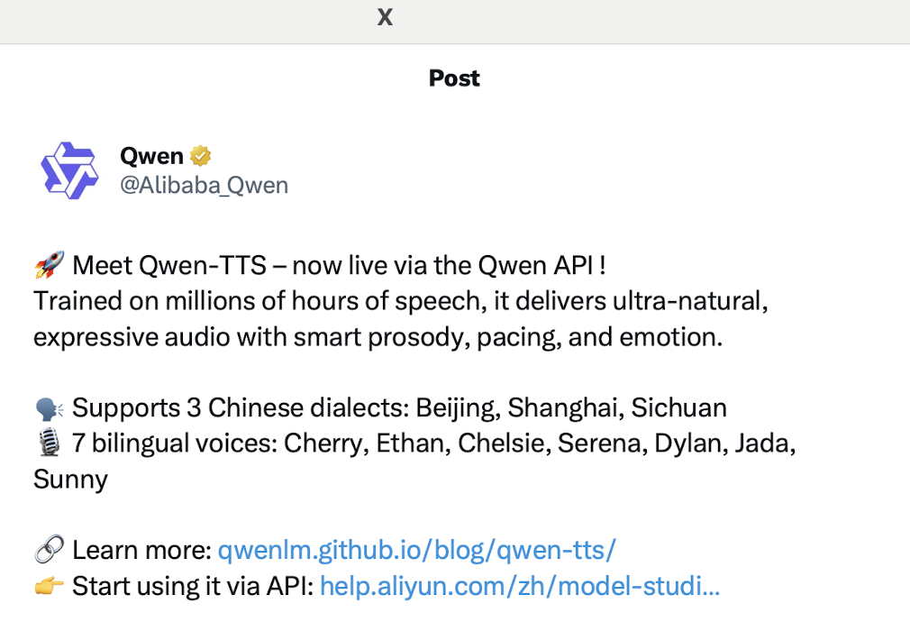
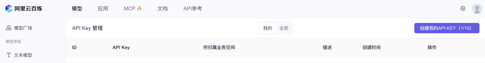

# 从零到一体验 Qwen-TTS：用四川话合成语音的全流程技术实录



## 引言

近年来，AI 语音合成（Text-to-Speech, TTS）技术飞速发展，已经从"能听懂"进化到"能听出情感、方言和个性"。阿里云 Qwen-TTS（通义千问语音合成）是国内首批支持多种中文方言（包括四川话、上海话、京片子）和中英双语的高质量 TTS 模型之一。本文将以四川话为例，带你从 API Key 获取、环境配置、代码实现、到常见问题排查，完整体验 Qwen-TTS 的技术魅力。

---

## 一、Qwen-TTS 简介与技术亮点

Qwen-TTS 是阿里云 DashScope 平台推出的高自然度、强表现力的语音合成模型。目前已支持四川话、上海话、京片子等，未来将扩展更多方言和语言7 种中英双语声音，适合多场景应用。自动根据文本调整语调、节奏、情感色彩，媲美真人朗读。通过 DashScope API 快速集成，支持 Python、RESTful 等多种调用方式。在 SeedTTS-Eval 等权威基准上达到人类水平的自然度和相似度。

> 官方博客与样例：https://qwenlm.github.io/blog/qwen-tts/

---

## 二、DashScope API Key 获取全流程

### 1. 注册并登录阿里云 DashScope

- 访问 [DashScope 官网](https://dashscope.aliyun.com/)
- 使用阿里云账号注册/登录（支持手机号、邮箱、企业账号等）

### 2. 进入 API Key 管理页面

- 登录后，点击右上角头像，进入"控制台"或"API Key 管理"
- 找到"API Key"或"密钥管理"入口



### 3. 创建并获取 API Key

- 点击"创建 API Key"或"生成新密钥"
- 通过手机/邮箱二次验证
- 复制生成的 API Key（**注意：只显示一次，务必保存**）

**API Key 格式示例：**
```
sk-xxxxxxxxxxxxxxxxxxxxxxxxxxxxxxxx
```
> 注意：**必须以 `sk-` 开头**，否则不是 DashScope 的 TTS API Key（如 `LTAI...` 开头的是阿里云 Access Key，不能用于 Qwen-TTS）。

### 4. 安全保存 API Key

- 建议保存到密码管理器或安全笔记
- 切勿公开或上传到代码仓库

---

## 三、环境配置与依赖安装

### 1. 克隆或下载项目

假设你已获得本文配套的 Qwen-TTS 四川话演示项目（或参考下方代码结构自行创建）：

```
csdn/
└── qwen-tts/
    ├── qwen_tts_sichuan_demo.py
    ├── requirements.txt
    ├── test_setup.py
    ├── config.py
    ├── env_example.txt
    └── output/   # 运行后自动生成
```

### 2. 安装依赖

进入 `qwen-tts` 目录，安装依赖：

```bash
cd qwen-tts
pip install -r requirements.txt
```

依赖说明：
- `dashscope`：阿里云 DashScope Python SDK
- `requests`：网络请求库
- `pygame`：音频播放（可选）
- `python-dotenv`：支持 .env 文件加载 API Key

### 3. 配置 API Key

**推荐方式：使用 .env 文件**

1. 复制示例文件并编辑
   ```bash
   cp env_example.txt .env
   nano .env
   ```
2. 填写你的 API Key（必须以 `sk-` 开头）：
   ```
   DASHSCOPE_API_KEY=sk-xxxxxxxxxxxxxxxxxxxxxxxxxxxxxxxx
   ```

**可选方式：环境变量**
```bash
export DASHSCOPE_API_KEY=sk-xxxxxxxxxxxxxxxxxxxxxxxxxxxxxxxx
```

---

## 四、代码实现与运行流程

### 1. 主要代码结构说明

`qwen_tts_sichuan_demo.py` 主要实现了以下功能：

- 自动加载 `.env` 文件或环境变量中的 API Key
- 支持多条四川话示例文本合成
- 自动创建输出目录，保存音频文件
- 可选实时播放合成音频
- 详细的错误处理与用户提示

**核心代码片段：**

```python
from dotenv import load_dotenv
import os

def _load_env_file(self):
    # 优先加载脚本目录下的 .env
    script_dir = Path(__file__).parent
    env_path = script_dir / ".env"
    if env_path.exists():
        load_dotenv(env_path)
    # 也可向上查找
    # ...

def _get_api_key(self):
    self._load_env_file()
    api_key = os.getenv("DASHSCOPE_API_KEY")
    if not api_key or not api_key.startswith("sk-"):
        raise EnvironmentError("请正确配置 DashScope API Key（以 sk- 开头）")
    return api_key
```

### 2. 运行演示脚本

**推荐先运行测试脚本：**
```bash
python test_setup.py
```
- 检查依赖、API Key、网络、目录等
- 若有问题会给出详细修复建议

```bash
🔑 Testing API key...
✅ API key found using environment variable: DASHSCOPE_API_KEY
   Key starts with: LTAI5tJU...
⚠️ API key doesn't start with 'sk-'. This might not be a valid DashScope API key.

📁 Testing directories...
✅ Output directory ready: /Users/zlu/projects/csdn/qwen-tts/output

🌐 Testing network connectivity...
✅ Network connectivity OK

📊 Test Summary
========================================
Imports         ✅ PASS
Environment File ✅ PASS
API Key         ✅ PASS
Directories     ✅ PASS
Network         ✅ PASS

Results: 5/5 tests passed
🎉 All tests passed! You're ready to run the demo.
```

**正式运行四川话合成演示：**
```bash
python qwen_tts_sichuan_demo.py
```

```bash
📄 Loading environment from: /Users/zlu/projects/csdn/qwen-tts/.env
✅ API key loaded successfully (starts with: sk-c4021...)
🎭 Qwen-TTS Sichuan Dialect Demo
==================================================
Model: qwen-tts-latest
Voice: Sunny (Sichuan dialect)
Output directory: output


📝 Sample 1: Traditional Sichuan Rhyme
Description: A traditional Sichuan children's rhyme about a chubby child
Text: 胖娃胖嘟嘟，骑马上成都，成都又好耍。胖娃骑白马，白马跳得高。胖娃耍关刀，关刀耍得圆。胖娃吃汤圆。
----------------------------------------
🎤 Synthesizing: 胖娃胖嘟嘟，骑马上成都，成都又好耍。胖娃骑白马，白马跳得高。胖娃耍关刀，关刀耍得圆。胖娃吃汤圆。...
📥 Downloading audio from: http://dashscope-result-wlcb.oss-cn-wulanchabu.aliyuncs.com/1d/2d/20250701/b02dd599/8df4ea6c-b22a-41ab-8b9e-2e659b3590e8.wav?Expires=1751419905&OSSAccessKeyId=LTAI5tKPD3TMqf2Lna1fASuh&Signature=%2FPm1kfFEwfDmmdDsEeriPIMdJO4%3D
✅ Audio saved to: output/sichuan_sample_01.wav
🎵 Play audio? (y/n): y
🔊 Playing audio...
✅ Audio playback completed
```

### 3. 交互与输出

- 程序会依次合成多条四川话文本（如童谣、日常对话、方言故事等）
- 合成音频保存在 `output/` 目录
- 若安装了 `pygame`，可选择实时播放音频
- 运行结束后会输出所有生成的音频文件路径

---

## 五、常见问题与排查

### 1. API Key 格式错误

**报错示例：**
```
⚠️ Warning: API key doesn't start with 'sk-'. This might not be a valid DashScope API key.
❌ Demo failed: Invalid API key
```
**解决方法：**
- 确认 API Key 来源于 DashScope 控制台
- 必须以 `sk-` 开头，不能用阿里云 Access Key

### 2. 找不到 .env 文件

**现象：**
- 明明 `.env` 在 `qwen-tts/`，但程序提示找不到

**原因：**
- 你可能在项目根目录运行脚本（`python qwen-tts/qwen_tts_sichuan_demo.py`），此时当前目录是 `csdn/`，而不是 `qwen-tts/`
- `.env` 只会在当前目录或父目录查找

**解决方法：**
- 推荐将 `.env` 放到项目根目录（`csdn/`）
- 或者进入 `qwen-tts/` 目录再运行脚本：
  ```bash
  cd qwen-tts
  python qwen_tts_sichuan_demo.py
  ```

### 3. 输出目录不存在

**报错示例：**
```
❌ Demo failed: [Errno 2] No such file or directory: 'qwen-tts/output'
```
**解决方法：**
- 手动创建输出目录：
  ```bash
  mkdir -p qwen-tts/output
  ```
- 或确保代码自动创建目录（本项目已支持）

### 4. 网络或依赖问题

- 检查网络是否可访问外网
- 确认已安装所有依赖（`pip install -r requirements.txt`）

---

## 六、进阶玩法与最佳实践

### 1. 扩展更多方言与自定义文本

- 可在 `config.py` 或主脚本中添加更多四川话/其他方言文本
- 支持自定义输出文件名、批量合成

### 2. 集成到 Web/移动应用

- Qwen-TTS 支持 RESTful API，可与 Flask、FastAPI、Django 等后端集成
- 也可用于小程序、App 的语音播报

### 3. 性能与费用

- DashScope 提供免费额度，超出后按量计费
- 建议先在免费额度内测试，量大可申请企业套餐

### 4. 安全与合规

- API Key 切勿上传到公开仓库
- 可用 `.gitignore` 忽略 `.env` 文件

---

## 七、Qwen-TTS 技术原理简述

- **大规模语音数据训练**：覆盖多方言、多场景
- **Transformer 架构**：支持高质量韵律与情感建模
- **多说话人/多风格**：可选不同性别、年龄、方言的声音
- **自动韵律调整**：根据文本内容智能断句、重音、语速
- **API 设计**：支持文本、说话人、风格等多参数定制

---

## 八、结语与展望

Qwen-TTS 让高质量中文方言语音合成变得触手可及。无论你是开发者、AI 研究者，还是方言文化爱好者，都可以通过简单的 API 和开源代码，体验到四川话、上海话、京片子等地道方言的数字化魅力。未来，随着模型能力和数据的不断提升，Qwen-TTS 有望支持更多方言、情感和应用场景，助力中文语音 AI 生态繁荣。

---

## 参考链接

- [Qwen-TTS 官方博客](https://qwenlm.github.io/blog/qwen-tts/)
- [DashScope 控制台](https://dashscope.aliyun.com/)
- [DashScope 文档](https://help.aliyun.com/zh/dashscope/)
- [Qwen GitHub](https://github.com/QwenLM/Qwen)
- [SeedTTS-Eval Benchmark](https://github.com/seedtts/seedtts-eval)

---

**欢迎留言交流你的体验与问题，也欢迎 PR 丰富更多方言和应用场景！** 